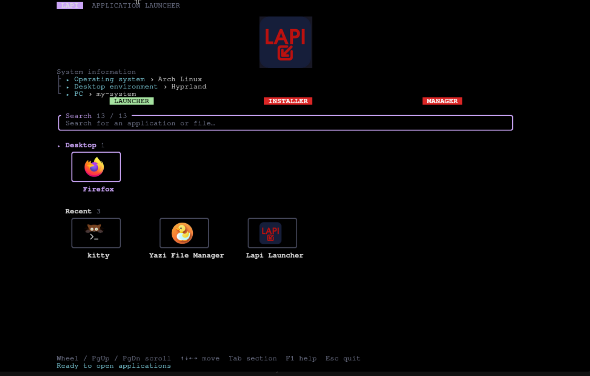
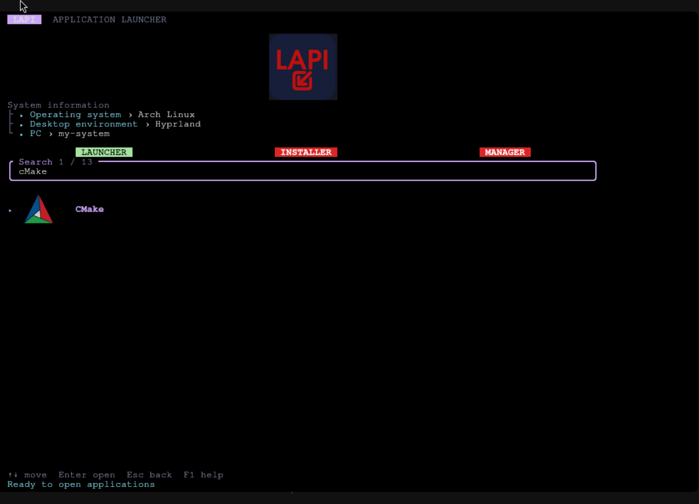
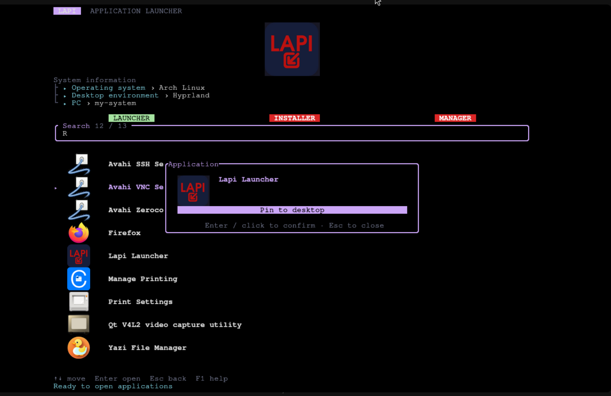
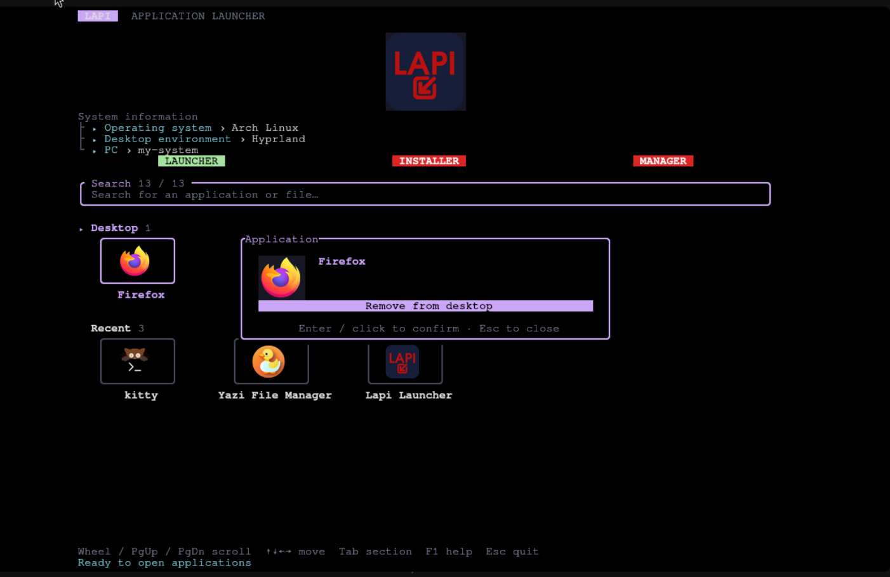
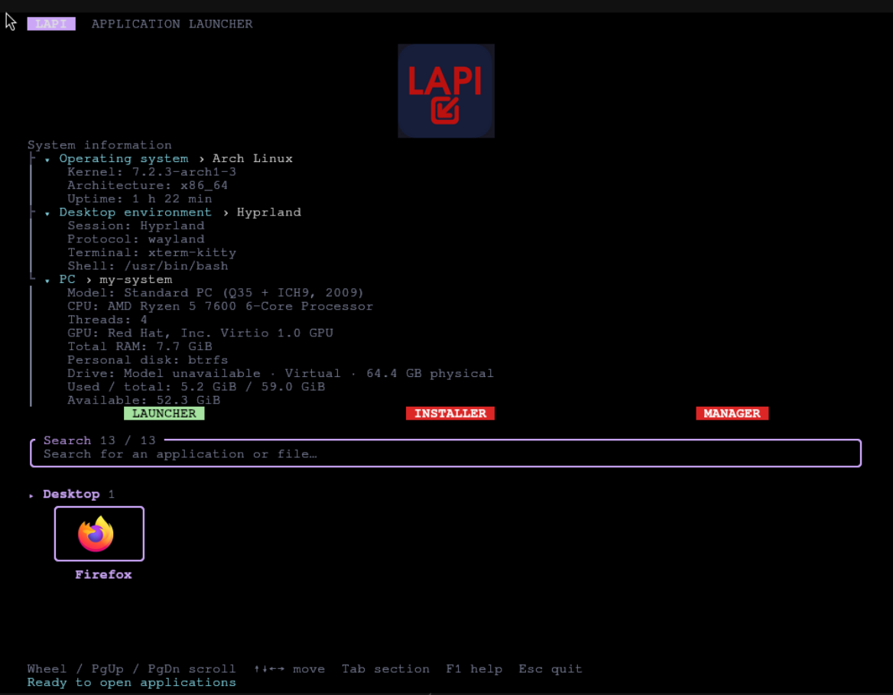

# Lapi Launcher

<p align="center">
  
</p>

<p align="center">
  <strong>A fast, keyboard-first Linux application launcher for the terminal.</strong><br>
  A Yazi-inspired TUI with fuzzy search, native terminal images, and no background service.
</p>

<p align="center">
  
</p>

## Built for a focused workflow

- **Start quickly** — one native Rust binary; no daemon, server, or runtime to manage.
- **Find anything** — fuzzy-search installed applications, desktop entries, files, and folders.
- **Stay in the terminal** — use keyboard, mouse, scroll wheel, and terminal-native icon rendering.
- **Keep your desktop curated** — pin or remove `.desktop` entries directly from the application menu.
- **Know your system** — inspect operating-system, session, hardware, GPU, RAM, and persistent-storage details.
- **Speak your language** — English and Spanish follow your session locale, with a configuration override.

## See it in action

### Home view

The home screen keeps your Desktop and recently opened entries visible in compact, single-row sections. Expand system rows when you need more detail, then scroll the complete view naturally.

<p align="center">
  
</p>

### Search without leaving the flow

Start typing to replace the home sections with one focused result list. Every result presents a readable alias and its icon—never an implementation filename.

<p align="center">
  
</p>

### Pin and unpin desktop entries

Right-click an application from search or Recent to open its action window. Pinning copies its `.desktop` entry into your XDG desktop directory; removing it deletes only that desktop copy.

<p align="center">
  
  
</p>

### System information, when you need it

Select Operating system, Desktop environment, or PC to expand passive startup details, including graphics hardware and persistent-storage capacity and usage.

<p align="center">
  
</p>

## Quick start

### Run a release binary

Download the `lapi-launcher` asset for your architecture, then run it in an interactive terminal:

```sh
chmod +x lapi-launcher
./lapi-launcher
```

### Install the Arch Linux package

Download `lapi-launcher.pkg.tar.zst` from the matching release:

```sh
sudo pacman -U lapi-launcher.pkg.tar.zst
```

### Build from source

```sh
cargo run --release
```

Lapi Launcher needs an interactive terminal with a viewport of at least 40 × 20 cells. Image support is optional: when your terminal cannot render graphics, the interface remains fully usable.

## Everyday controls

| Action | Control |
| --- | --- |
| Search | Type or paste text |
| Move selection | Arrow keys or mouse wheel |
| Open selection | Enter, click, or double-click |
| Pin or remove from Desktop | Right-click an application, then press Enter or click |
| Expand system information | Click a row or press F2 / F3 / F4 |
| Move through sections | Tab / Shift+Tab or click a heading |
| Refresh applications | F5 |
| Clear search / go back | Esc, Ctrl+L, or Ctrl+U |
| Open help | F1 |
| Quit | Esc on the home view or Ctrl+C |

## Configure it your way

Lapi Launcher reads configuration with **user-first priority**:

1. `${XDG_CONFIG_HOME:-~/.config}/lapi-launcher/config.toml`
2. `/etc/lapi-launcher/config.toml`

On first run, it creates a user configuration and places the official `logo.png` beside it. The default relative logo path always resolves to the logo closest to the configuration file. A custom logo can be any supported raster image; `PNG` is recommended.

Use [config.example.toml](config.example.toml) to configure the logo, terminal-image protocol, language, recent-item limit, close-on-launch behavior, application directories, and the complete interface theme.

Right-click anywhere outside an application icon to open the in-terminal theme editor. It previews changes immediately, offers a curated palette with `Left` / `Right`, accepts exact `#RRGGBB` values (or `terminal` for native terminal foreground and background), and writes only saved changes to the user configuration. `border_style` also supports `plain`, `rounded`, `double`, and `thick`.

## Lapi ecosystem

Lapi Launcher is useful on its own. When installed, its companion controls create a smooth terminal workflow:

- **LAUNCHER** — identifies the current application.
- **INSTALLER** — replaces Lapi Launcher with `lapi-installer` in the same terminal.
- **MANAGER** — replaces Lapi Launcher with `lapi-manager` in the same terminal.

If either companion executable is unavailable in `PATH`, Lapi Launcher stays open and shows a clear status message.

## Packaging and development

- [Arch Linux binary package guide](packaging/README.md) — package contents, GitHub Release assets, local builds, and AUR publishing.
- `cargo run -- --list` — inspect the discovered application catalog without opening the TUI.
- `cargo run -- --no-images` — start without terminal image rendering.
- `cargo run -- --print-default-config` — print the built-in configuration template.

Lapi Launcher discovers desktop entries from standard XDG paths and supported Flatpak and Snap exports. Its local Recent history records only entries opened through Lapi.

## License

Distributed under the [MIT License](LICENSE).
